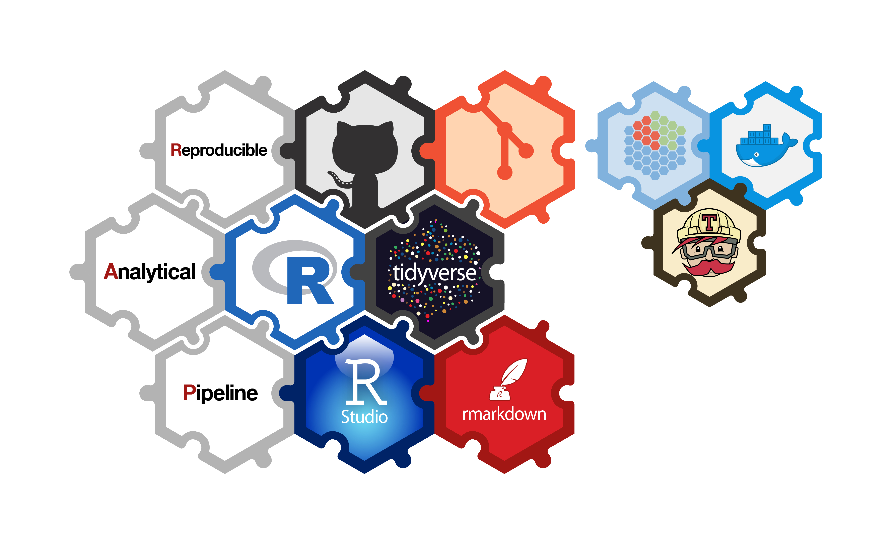

```{r setup, include = FALSE}
library(knitr)
library(magrittr)
library(kableExtra)

knitr::opts_chunk$set(echo = FALSE)

# Create data frame for levels of automation table
automation_levels <- data.frame(c(1:3, c("4a", "4b"), 5:7),
                                c("Ad hoc R code",
                                  "R project",
                                  "R project under version control (VC)",
                                  "R project under VC and peer reviewed (wrangling)",
                                  "Replicable report in Rmarkdown (publication)",
                                  "Near RAP (as above plus data quality assurance and                                          package management)",
                                  "Full RAP (as above plus unit testing and documentation)",
                                  "R package"))

```

## What we will cover today

<div class="columns-2">
<ul>
```{r out.width = "22%"}

```
<br>
```{r out.width = "6%"}
include_graphics("images/twitter.png")
```
@price_AH
<br>
```{r out.width = "6%"}
include_graphics("images/github.png")
```
annahprice
</ul>
<ul>
**Anna Price**: Levels of RAP and biggest challenges
</div>

<div class="columns-2">
<ul>
```{r out.width = "22%"}

```
<br>
```{r out.width = "6%"}
include_graphics("images/twitter.png")
```
@Tyjet92
<br>
```{r out.width = "6%"}
include_graphics("images/github.png")
```
davidc92
</ul>
<ul>
**David Caldwell**: Our first RAP project
</div>

<div class="columns-2">
<ul>
```{r out.width = "22%"}

```
<br>
```{r out.width = "6%", }
include_graphics("images/github.png")
```
jackhannah95
</ul>
<ul>
**Jack Hannah**: Scaling RAP in NHS Scotland
</div>

<br>
Contact us: nss.isdtransformingpublishing@nhs.net
[Transforming Publishing on GitHub](https://github.com/NHS-NSS-transforming-publications)

## Background

- The Information Services Division (ISD) of the National Health Service (NHS) Scotland produces around 200 official and national statistics publications each year.
- Traditional publication output is a **static pdf document** with accompanying **excel tables**.
- Production uses **proprietary software** and is **time-consuming**, involving extensive manual formatting and checking.

```{r out.width = "40%", fig.align = 'center'}
include_graphics("images/pdf report.png")
```

## What is a RAP project?

- No (or few) manual steps = data and output produced using code
- High quality and auditable = version control
- Sustainable = peer review
- "Bells and whistles" = _functions, documenting/testing these functions, package management and computing environment_

```{r out.width = "60%", fig.align = 'center'}

```

## [Levels of RAP/automation](https://www.isdscotland.org/About-ISD/Methodologies/_docs/Reproducible_Analytical_Pipelines_paper_v1.4.pdf)

```{r, echo = FALSE}
    kable(automation_levels,
          col.names = c("Level", "Description"),
          format = "markdown")
```

## Challenges

- Senior management buy in
- Culture change (peer review and working in the open)
- New skills for analysts to learn (R, git, etc)
- Required development time
- Range of data sources and/or unstable production process
- IT...

## IT Infrastructure

- R desktop and server versions
- RStudio Server Pro
- Package management
- git
- git-repository hosting service (GitHub/Gitea)

And what's next...? Travis? Docker?

## Questions/Discussion

Do others have experience of similar challenges in their department/organisation?
<br>
<br>
What makes a RAP project?
<br>
<br>
What level of RAP are others working to?